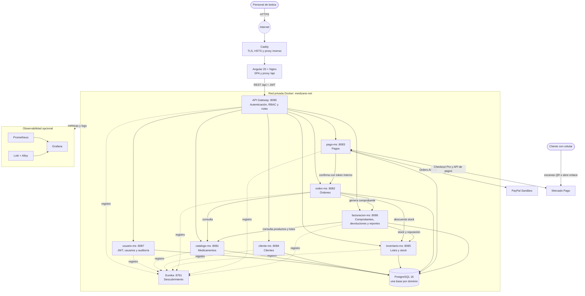
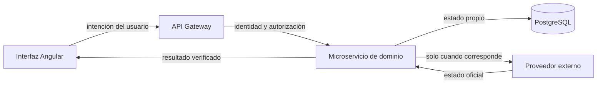

# Cómo funciona la aplicación

## Diagrama general

Este diagrama representa el despliegue de producción y las relaciones que existen en el código actual.

## Camino de una solicitud

1. El navegador carga la aplicación Angular desde Nginx.
2. Caddy termina TLS en producción; Nginx sirve la SPA y reenvía `/api` al API Gateway.
3. Después del login, Angular adjunta el JWT a las solicitudes protegidas.
4. El Gateway valida firma, vigencia y rol, añade la identidad en cabeceras internas y resuelve el servicio mediante Eureka.
5. Cada microservicio aplica su regla de negocio y guarda únicamente los datos de su dominio en PostgreSQL.
6. Las operaciones entre servicios usan REST/OpenFeign. Las confirmaciones críticas entre `pago-ms`, `orden-ms`, `inventario-ms` y `facturacion-ms` incluyen controles de idempotencia y reintentos programados.

## Separación de responsabilidades

La interfaz nunca determina por sí sola que un pago fue exitoso. `pago-ms` consulta a la pasarela y valida orden, monto y moneda antes de confirmar la venta.

## Desarrollo y producción

| Capa | Desarrollo con `docker-compose.yml` | Producción con override |
| --- | --- | --- |
| Entrada | Frontend `:4200`, Gateway `:8090` | Caddy `:80/:443` |
| TLS | No incluido | Certificado automático de Caddy |
| Servicios internos | Red `medizano-net` | Red `medizano-net` |
| Observabilidad | Puertos locales para Prometheus y Grafana | Perfil opcional `observability` |
| Persistencia | Volumen Docker de PostgreSQL | Volúmenes persistentes y respaldo programado |

El módulo `config-server` forma parte del reactor Maven, pero el despliegue actual obtiene su configuración de los archivos `application.yml` y de variables de entorno; no se levanta como servicio en Docker Compose.
