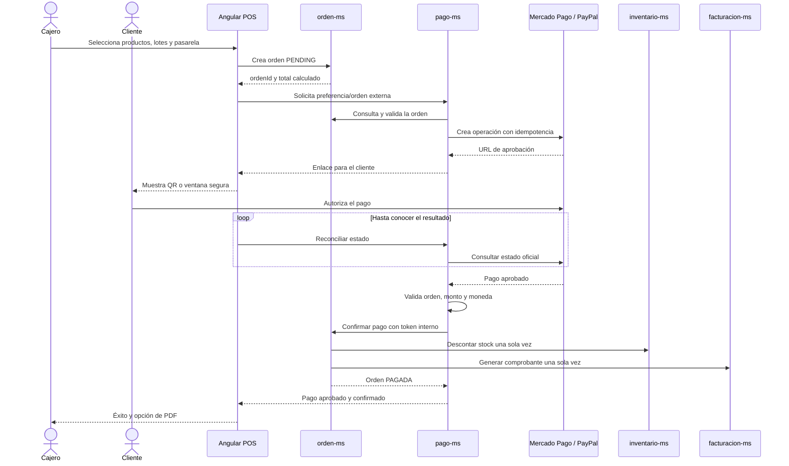
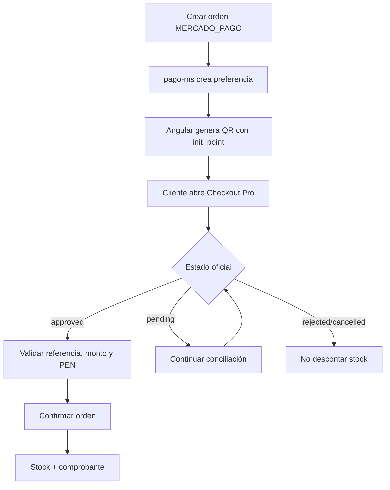

# Ventas y pagos

MediZano separa los cobros presenciales en efectivo de los pagos electrónicos. Esta distinción evita descontar stock o emitir un comprobante antes de que una pasarela confirme realmente el dinero.

## Flujo completo de pago electrónico

## Efectivo

1. El cajero añade productos y selecciona un lote vigente.
2. `facturacion-ms` vuelve a consultar catálogo e inventario; no confía en el precio recibido desde Angular.
3. Valida el importe entregado, calcula el vuelto y registra el monto neto aplicado.
4. Descuenta stock mediante una operación idempotente.
5. Marca el comprobante como pagado y permite descargar el PDF.

Los pagos electrónicos no pueden entrar por el endpoint directo de facturación; deben pasar por `orden-ms` y `pago-ms`.

## Mercado Pago Checkout Pro

Características implementadas:

- Preferencia con `external_reference` igual al identificador de la orden.
- QR generado en el navegador a partir del enlace oficial de Checkout Pro.
- Botón para copiar el enlace y enviarlo al cliente.
- `back_urls` para éxito, pendiente y fallo; `auto_return` para pagos aprobados.
- Webhook público con validación HMAC mediante `x-signature` y `x-request-id`.
- Conciliación automática por `preferenceId` si el retorno del navegador no trae toda la información.
- Verificación de `payment_id` directamente contra la API de Mercado Pago.
- Idempotencia para no duplicar preferencias, pagos ni efectos posteriores.

!!! note "Pruebas"
    Las credenciales de la aplicación y la cuenta compradora deben pertenecer al mismo ambiente y país. Un pago de prueba no aparece como dinero real en la cuenta productiva.

## PayPal

PayPal permanece disponible y usa **Orders API v2 en Sandbox** por defecto:

1. `pago-ms` convierte el total en PEN a USD con `PAYPAL_EXCHANGE_RATE`.
2. Crea una orden `CAPTURE` y devuelve la URL de aprobación.
3. Angular abre esa URL en una ventana separada y consulta periódicamente el estado.
4. Cuando PayPal informa `APPROVED`, el backend realiza la captura automáticamente.
5. Solo acepta `COMPLETED` si coinciden la orden interna, el monto y la moneda.
6. Confirma la orden y activa el mismo postpago de inventario y facturación.

No existe un botón manual que pueda declarar el pago exitoso sin consultar a PayPal.

## Recuperación e idempotencia

- `pago-ms` reintenta cada 30 segundos las confirmaciones aprobadas que aún no llegaron a `orden-ms`.
- `orden-ms` reintenta las órdenes pagadas cuyo descuento de stock o comprobante quedó pendiente.
- Inventario identifica cada operación de venta/devolución para impedir dobles movimientos.
- Las llamadas repetidas de verificación devuelven el resultado existente cuando ya fue aprobado.

## Devoluciones: límite actual

El módulo de devoluciones valida cantidades acumuladas, registra el importe a devolver y repone el lote correspondiente. Sin embargo, **no llama todavía a las API de refund de Mercado Pago o PayPal**. Para pagos electrónicos, el reembolso monetario debe gestionarse manualmente en la pasarela hasta implementar y probar ese flujo.
