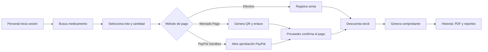

# MediZano Botica

MediZano es una aplicación web interna para administrar una botica: ventas en caja, catálogo de medicamentos, lotes y existencias, clientes, comprobantes, devoluciones, reportes, usuarios y auditoría.

La solución usa una arquitectura de microservicios con **Angular 20**, **Spring Boot 3.2**, **Spring Cloud**, **PostgreSQL 16** y **Docker Compose**. En producción, **Caddy** publica el sistema por HTTPS y el resto de los componentes permanece dentro de la red privada de Docker.

!!! info "Estado de esta documentación"
    Actualizada el **11 de septiembre de 2026** a partir del repositorio real [MediZano_microservicios](https://github.com/rbn-69-cod/MediZano_microservicios), incluido el flujo de pagos incorporado en el commit `6dc1457`.

## Qué puede hacer el personal

- Iniciar sesión y acceder a funciones según su rol.
- Buscar medicamentos por nombre o código de barras.
- Seleccionar un lote vigente y validar su stock y precio oficial.
- Cobrar en efectivo, Mercado Pago o PayPal Sandbox.
- Mostrar al cliente un QR o compartir un enlace de Mercado Pago.
- Confirmar electrónicamente una venta sin confiar en datos del navegador.
- Descontar inventario y generar el comprobante después del pago.
- Consultar ventas, descargar comprobantes PDF, gestionar devoluciones y revisar reportes.
- Administrar usuarios y consultar historiales de acceso y actividad.

## Recorrido principal

## Documentos principales

- [Cómo funciona la aplicación](arquitectura/index.md): arquitectura completa y comunicaciones.
- [Microservicios y módulos](arquitectura/modulos.md): responsabilidades, puertos y pantallas.
- [Ventas y pagos](flujos/ventas-pagos.md): efectivo, Mercado Pago, PayPal y confirmación automática.
- [Despliegue y configuración](operacion/despliegue.md): ejecución local y publicación segura.
- [Verificación y soporte](operacion/verificacion.md): pruebas, salud, observabilidad y diagnóstico.
- [Brief técnico actualizado](proyecto-sello/brief.md): alcance académico y situación actual.

## Estado de las pasarelas

| Medio | Estado actual | Moneda | Confirmación |
| --- | --- | --- | --- |
| Efectivo | Implementado | PEN | Inmediata en backend |
| Mercado Pago Checkout Pro | Implementado; depende de las credenciales configuradas | PEN | Webhook firmado y reconciliación automática |
| PayPal Orders API v2 | Implementado en Sandbox | USD | Consulta, captura y reconciliación automática |

!!! warning "Antes de cobrar dinero real"
    PayPal usa Sandbox por defecto. Mercado Pago debe probarse con cuentas y credenciales coherentes con el ambiente elegido. Además, el flujo actual de devoluciones no ejecuta todavía el reembolso monetario automático en Mercado Pago o PayPal.
