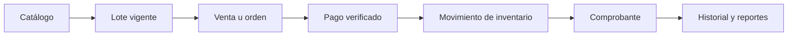

# Brief técnico actualizado

## Identificación

- **Proyecto:** MediZano Botica
- **Dominio:** punto de venta y gestión farmacéutica
- **Repositorio de aplicación:** [rbn-69-cod/MediZano_microservicios](https://github.com/rbn-69-cod/MediZano_microservicios)
- **Repositorio de documentación:** [Aldo-Ct/Medizano-Docs](https://github.com/Aldo-Ct/Medizano-Docs)

| Integrante | Énfasis |
| --- | --- |
| Aldo Calla Ticona | Backend, frontend e infraestructura |
| Igarlos Ruben Mamani Quispe | Seguridad e integración de pagos |
| Kengui P. Calsin Mamani | Inventario y gestión de clientes |

## Problema que resuelve

MediZano centraliza la operación diaria de una botica. Permite al personal vender medicamentos con trazabilidad de lote, controlar existencias y vencimientos, cobrar mediante distintos medios, emitir comprobantes, procesar devoluciones, consultar reportes y auditar el acceso al sistema.

El producto actual es un **sistema interno para personal autorizado**, no una tienda pública para que el cliente administre el POS.

## Flujo extremo a extremo

## Arquitectura implementada

- Frontend SPA con Angular 20 y Nginx.
- API Gateway con JWT y control de acceso por roles.
- Eureka para descubrimiento de servicios.
- Microservicios Spring Boot para usuarios, catálogo, clientes, inventario, órdenes, pagos y facturación.
- PostgreSQL 16 con una base lógica por dominio.
- Mercado Pago Checkout Pro con QR/enlace, webhook y conciliación.
- PayPal Orders API v2 en ambiente Sandbox.
- Caddy con HTTPS para producción.
- Prometheus, Loki, Alloy y Grafana como observabilidad opcional.

## Microservicios

| Servicio | Tipo | Alcance |
| --- | --- | --- |
| `usuario-ms` | Soporte | Autenticación, usuarios y auditoría |
| `catalogo-ms` | Dominio | Medicamentos, productos y códigos |
| `cliente-ms` | Dominio | Información de clientes |
| `inventario-ms` | Transaccional | Lotes, stock y movimientos |
| `orden-ms` | Transaccional | Órdenes y coordinación postpago |
| `pago-ms` | Transaccional | Pasarelas, verificación y confirmación |
| `facturacion-ms` | Transaccional | Ventas, comprobantes, devoluciones y reportes |

## Actores y roles

- `ADMIN`: administración completa.
- `CASHIER`: ventas y cobros.
- `STOCK_KEEPER`: medicamentos.
- `STOCK_MONITOR`: inventario.
- `CUSTOMER_SUPPORT`: devoluciones.
- `ANALYST` y `MANAGER`: reportes e historial según permisos.

## Alcance cubierto

- Autenticación y autorización por rol.
- Catálogo farmacéutico y búsqueda por código de barras.
- Gestión de lotes, precios, stock, vencimientos y movimientos.
- POS con efectivo, Mercado Pago y PayPal Sandbox.
- Confirmación automática y segura de pagos electrónicos.
- Comprobantes PDF, historial, devoluciones y reportes.
- Despliegue Docker con HTTPS, healthchecks, respaldo y observabilidad.

## Fuera de alcance o pendiente

- Aplicación móvil nativa.
- Logística de entrega y seguimiento GPS.
- Integración con proveedores farmacéuticos externos.
- Reembolso monetario automático desde Mercado Pago o PayPal.
- PayPal productivo: el ambiente predeterminado documentado e implementado es Sandbox.
- Homologación tributaria externa: los comprobantes internos no sustituyen una integración certificada con SUNAT.

## Criterio de aceptación principal

Una venta electrónica se considera terminada solamente cuando la pasarela confirma el pago, el backend valida orden/monto/moneda, `orden-ms` queda en estado pagado, inventario registra una única salida y facturación genera un único comprobante.
