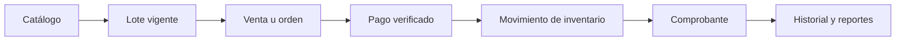
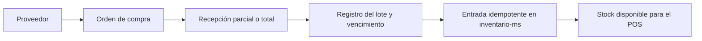
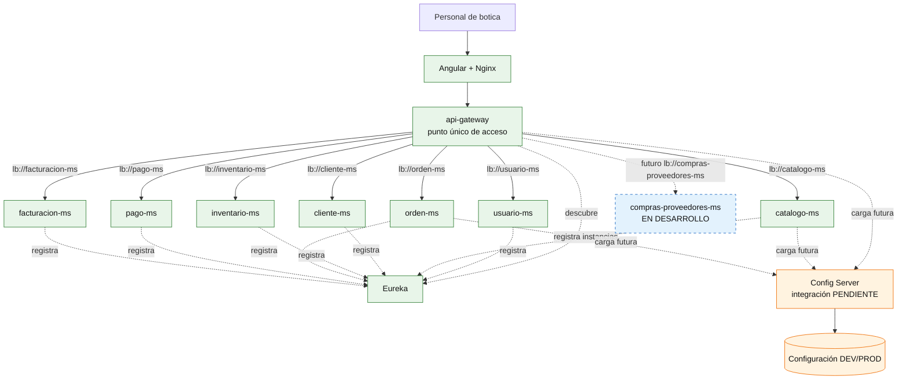

# Brief técnico y producto de Unidad I

Este documento adapta MediZano a la estructura exigida para el **Sistema distribuido base funcional, configurable y preparado para múltiples instancias**. Se elaboró siguiendo la [guía de sustentación de la sesión 5](https://262dist.github.io/pagatu/sesiones/S05_Evaluacion_Unidad_1/) y la [plantilla del producto de Unidad I](https://262dist.github.io/pagatu/proyecto-sello/u1-producto/).

!!! info "Lectura del estado"
    **IMPLEMENTADO** significa que existe código funcional en el repositorio. **PARCIAL** indica que existe una base, pero falta la evidencia o integración requerida por la evaluación. **EN DESARROLLO** describe un componente planificado y todavía no debe presentarse como terminado.

## 1. Identificación del proyecto

- **Equipo:** MediZano
- **Proyecto:** MediZano Botica
- **Dominio:** punto de venta y gestión farmacéutica
- **Repositorio de aplicación:** [rbn-69-cod/MediZano_microservicios](https://github.com/rbn-69-cod/MediZano_microservicios)
- **Repositorio de documentación:** [Aldo-Ct/Medizano-Docs](https://github.com/Aldo-Ct/Medizano-Docs)
- **Documentación publicada:** [aldo-ct.github.io/Medizano-Docs](https://aldo-ct.github.io/Medizano-Docs/)
- **Topics académicos:** **PENDIENTE**. Ambos repositorios están actualmente sin topics; antes de sustentar se debe agregar el topic indicado por el docente, por ejemplo `grupo-<numero>-medizano`.

### Integrantes y aporte para sustentar

| Integrante | Responsabilidad principal | Evidencia individual esperada |
| --- | --- | --- |
| **Chambilla Serrano Juan Diego** | `facturacion-ms` y diseño de `compras-proveedores-ms` | Comprobantes/devoluciones y especificación del nuevo servicio en desarrollo |
| **Mamani Quispe Igarlos Ruben** | `pago-ms` y seguridad | Verificación de pagos, webhooks, idempotencia y protección de credenciales |
| **Calla Ticona Aldo** | `orden-ms`, `catalogo-ms`, frontend e infraestructura | Flujo POS, Gateway, despliegue y coordinación postpago |
| **Calsin Mamani Kengui P.** | `inventario-ms` y `cliente-ms` | Lotes, movimientos de stock y gestión de clientes |

La tabla fija una distribución clara para la exposición. Cada integrante debe demostrar personalmente una operación, explicar una decisión y responder una pregunta técnica relacionada con su aporte.

## 2. Resumen ejecutivo y dominio

MediZano centraliza la operación diaria de una botica. El personal autorizado puede administrar medicamentos y lotes, controlar stock y vencimientos, registrar clientes, realizar ventas, cobrar en efectivo o mediante una pasarela, emitir comprobantes, procesar devoluciones y consultar reportes y auditorías.

El producto actual es un **sistema interno para personal de botica**, no una tienda pública. El cliente participa en el pago electrónico escaneando un QR o abriendo el enlace seguro de la pasarela, pero no accede al panel administrativo.

### Actores

| Actor | Función |
| --- | --- |
| `ADMIN` | Administración completa, usuarios y auditoría |
| `CASHIER` | Ventas, cobros y comprobantes |
| `STOCK_KEEPER` | Registro y actualización de medicamentos |
| `STOCK_MONITOR` | Lotes, stock, vencimientos y movimientos |
| `CUSTOMER_SUPPORT` | Devoluciones |
| `ANALYST` / `MANAGER` | Reportes e historial según permisos |
| Cliente de la botica | Autoriza el pago en Mercado Pago o PayPal fuera del dashboard |

### Flujo principal

## 3. Alcance de servicios

| Servicio | Rol dentro del sistema | Persistencia | Estado |
| --- | --- | --- | --- |
| `config-server` | Configuración centralizada por ambiente, puerto `8888` | Configuración nativa incluida en el artefacto | **PARCIAL**: módulo existente, no levantado por el Compose actual |
| `eureka-server` | Registro y descubrimiento dinámico, puerto `8761` | No aplica | **IMPLEMENTADO** |
| `api-gateway` | Punto único de API, JWT, RBAC y rutas `lb://`, puerto `8090` | No aplica | **IMPLEMENTADO** |
| `usuario-ms` | Autenticación, usuarios, roles y auditoría | `medizano_usuarios_db` | **IMPLEMENTADO** |
| `catalogo-ms` | Productos, medicamentos y códigos de barras | `medizano_catalogo_db` | **IMPLEMENTADO** |
| `cliente-ms` | Directorio de clientes | `medizano_clientes_db` | **IMPLEMENTADO** |
| `inventario-ms` | Lotes, vencimientos, stock y movimientos idempotentes | `medizano_inventario_db` | **IMPLEMENTADO** |
| `orden-ms` | Órdenes y coordinación posterior al pago | `medizano_ordenes_db` | **IMPLEMENTADO** |
| `pago-ms` | Mercado Pago, PayPal, verificación y conciliación | `medizano_pagos_db` | **IMPLEMENTADO** |
| `facturacion-ms` | Ventas, IGV, PDF, devoluciones y reportes | `medizano_facturacion_db` | **IMPLEMENTADO** |
| `compras-proveedores-ms` | Proveedores, órdenes de compra y recepción de mercadería | Base propia prevista | **EN DESARROLLO** |

## 4. Servicio nuevo: `compras-proveedores-ms`

### Estado y propósito

> **ESTADO: EN DESARROLLO — no forma parte todavía de la versión ejecutable.**

Su objetivo será cerrar el ciclo de abastecimiento que hoy empieza manualmente en inventario:

### Responsabilidad exacta

El servicio administrará el proceso desde la selección del proveedor hasta la recepción de los productos. Será dueño de proveedores, órdenes de compra y recepciones; **no será dueño del catálogo ni del stock** y no escribirá directamente en las bases de otros microservicios.

Funciones previstas:

1. Registrar, consultar, actualizar y desactivar proveedores.
2. Crear órdenes de compra con cabecera y detalle.
3. Consultar `catalogo-ms` para validar que cada medicamento exista y esté activo.
4. Manejar estados `BORRADOR`, `EMITIDA`, `PARCIALMENTE_RECIBIDA`, `RECIBIDA` y `CANCELADA`.
5. Registrar recepciones parciales o totales sin superar la cantidad pendiente.
6. Capturar número de lote, fecha de vencimiento, costo unitario y cantidad recibida.
7. Solicitar a `inventario-ms` la creación/actualización del lote y la entrada de stock.
8. Usar una referencia idempotente para que reintentar una recepción no duplique existencias.
9. Conservar el historial de costos de adquisición y diferencias entre lo pedido y lo recibido.
10. Exponer datos de compras para futuros reportes de margen y reposición.

### Modelo de datos previsto

| Entidad | Datos principales |
| --- | --- |
| `Proveedor` | id, RUC/documento, razón social, contacto, teléfono, correo, dirección, activo |
| `OrdenCompra` | id, número, proveedorId, fecha, estado, subtotal, impuesto, total |
| `DetalleOrdenCompra` | id, ordenCompraId, medicamentoId, cantidadPedida, costoUnitario, cantidadRecibida |
| `RecepcionCompra` | id, ordenCompraId, númeroRecepción, fecha, usuario, referenciaIdempotencia |
| `DetalleRecepcion` | id, recepciónId, detalleOrdenId, lote, vencimiento, cantidad, costoUnitario |

### Contrato REST previsto

| Método | Endpoint | Propósito | Resultado/error que se demostrará |
| --- | --- | --- | --- |
| `GET` | `/api/v1/proveedores` | Listar proveedores | `200` |
| `GET` | `/api/v1/proveedores/{id}` | Consultar proveedor | `200` / `404` |
| `POST` | `/api/v1/proveedores` | Crear proveedor | `201` / `400` |
| `PUT` | `/api/v1/proveedores/{id}` | Actualizar proveedor | `200` / `404` |
| `DELETE` | `/api/v1/proveedores/{id}` | Desactivar proveedor | `204` / `409` si tiene operaciones incompatibles |
| `GET` | `/api/v1/compras` | Listar órdenes de compra | `200` |
| `GET` | `/api/v1/compras/{id}` | Consultar una orden | `200` / `404` |
| `POST` | `/api/v1/compras` | Crear orden en borrador | `201` / `400` |
| `PUT` | `/api/v1/compras/{id}` | Editar una orden en borrador | `200` / `409` si ya fue emitida |
| `POST` | `/api/v1/compras/{id}/emitir` | Emitir la orden | `200` / `409` |
| `POST` | `/api/v1/compras/{id}/recepciones` | Registrar recepción y enviar la entrada a inventario | `201` / `400` / `409` |
| `POST` | `/api/v1/compras/{id}/cancelar` | Cancelar cuando la regla lo permita | `200` / `409` |

### Comunicaciones previstas

- Se registrará en Eureka como `compras-proveedores-ms`.
- El Gateway publicará `/api/v1/proveedores/**` y `/api/v1/compras/**` mediante `lb://compras-proveedores-ms`.
- Consumirá `catalogo-ms` para validar medicamentos.
- Consumirá `inventario-ms` para registrar lotes y entradas de stock.
- Cargará su configuración desde Config Server cuando la configuración centralizada esté integrada.
- Guardará sus datos en una base propia; no compartirá tablas con otros servicios.

### Seguridad prevista

| Operación | Roles |
| --- | --- |
| Consultar proveedores y compras | `ADMIN`, `MANAGER`, `STOCK_MONITOR` |
| Crear o modificar proveedores y órdenes | `ADMIN`, `MANAGER` |
| Registrar una recepción | `ADMIN`, `STOCK_KEEPER` |
| Cancelar una orden emitida | `ADMIN`, `MANAGER` |

### Reglas de aceptación

- No se puede comprar un medicamento inexistente o inactivo.
- No se puede recibir una cantidad superior a la pendiente.
- No se acepta un lote vencido al momento de la recepción.
- Una misma referencia de recepción no puede incrementar dos veces el stock.
- La orden pasa a `RECIBIDA` solo cuando todos sus detalles están completos.
- Si `inventario-ms` no está disponible, la recepción debe quedar identificada para reintento y no aparentar una entrada confirmada.

## 5. Contrato REST actual por Gateway

Todo cliente web usa el punto único de acceso. Los puertos internos de los microservicios no forman parte del contrato externo.

| Dominio | Prefijo en Gateway | Operaciones representativas |
| --- | --- | --- |
| Autenticación | `/api/auth/**` | Login y logout |
| Usuarios y auditoría | `/api/admin/users/**`, `/api/admin/audit/**` | CRUD administrativo y consultas de auditoría |
| Catálogo | `/api/v1/productos/**`, `/api/pharmacist/medicines/**` | CRUD, búsqueda y código de barras |
| Clientes | `/api/v1/clientes/**` | CRUD y búsqueda por documento |
| Inventario | `/api/v1/inventario/**`, `/api/pharmacist/batches/**` | Entradas, salidas, lotes, stock y movimientos |
| Órdenes | `/api/v1/ordenes/**` | Crear, consultar, confirmar pago y cancelar |
| Pagos | `/api/v1/pagos/**` | Crear, verificar, conciliar y recibir webhook |
| Facturación | `/api/v1/facturacion/**`, `/api/cashier/bills/**` | Crear/consultar comprobantes y descargar PDF |
| Devoluciones y reportes | `/api/cashier/returns/**`, `/api/admin/reports/**` | Registrar devolución y consultar indicadores |
| Compras, previsto | `/api/v1/proveedores/**`, `/api/v1/compras/**` | CRUD y recepción de compras |

La documentación OpenAPI agregada se consulta en desarrollo mediante `http://localhost:8090/swagger-ui.html`.

### CRUD elegido para la demostración

Para cumplir la evaluación se propone demostrar `Producto` en `catalogo-ms`:

1. `POST /api/v1/productos`: creación válida y una solicitud inválida con respuesta `400`.
2. `GET /api/v1/productos`: listado persistido.
3. `GET /api/v1/productos/{id}`: consulta válida y un identificador inexistente con respuesta `404`.
4. `PUT /api/v1/productos/{id}`: actualización.
5. `DELETE /api/v1/productos/{id}`: eliminación o desactivación según la regla implementada.
6. Reiniciar la instancia y demostrar que PostgreSQL conserva los datos.

## 6. Configuración por ambiente

| Aspecto | DEV | PROD |
| --- | --- | --- |
| Entrada web | `http://localhost:4200` | `https://medizano.sbs` mediante Caddy |
| Gateway | Host `:8090` | Solo red interna Docker |
| Eureka | Host `:8761` para inspección | Solo red interna Docker |
| Microservicios | Puertos internos `8081`–`8087` | Sin exposición al host |
| PostgreSQL | Volumen Docker, puerto interno `5432` | Volumen persistente, sin exposición |
| CORS | Orígenes locales | Dominio HTTPS configurado |
| Observabilidad | Prometheus `:9090`, Grafana `:3000` | Perfil opcional `observability` |
| Secretos | Archivo `.env` ignorado por Git | Variables `.env` privadas en el VPS |

Variables sensibles: `POSTGRES_PASSWORD`, `JWT_SECRET`, `MEDIZANO_DEFAULT_PASSWORD`, `INTERNAL_SERVICE_TOKEN`, credenciales de Mercado Pago/PayPal y contraseña de Grafana. Ningún valor real debe aparecer en el repositorio o en las capturas.

### Estado frente al requisito de Config Server

El repositorio contiene `config-server` en el puerto `8888` y una configuración nativa base. Sin embargo, los servicios desplegados actualmente leen principalmente `application.yml` y variables de entorno, y `config-server` no está incluido en Docker Compose. Por tanto, la evidencia de **Config Server operativo con diferencias DEV/PROD** está **PENDIENTE** y no debe declararse cumplida hasta que:

1. Config Server se levante en ambos ambientes.
2. Gateway y al menos dos microservicios actúen como Config Client.
3. Existan propiedades distintas y verificables para DEV y PROD.
4. El mismo artefacto arranque en ambos ambientes sin editar código.
5. La demostración oculte todos los secretos.

## 7. Arquitectura distribuida de Unidad I

### Registro, múltiples instancias y balanceo

Eureka y las rutas `lb://` del Gateway están implementados. El Compose actual levanta una instancia por microservicio, por lo que la evidencia de balanceo entre **dos instancias simultáneas** aún está **PENDIENTE**.

Para aceptar este criterio durante la sustentación debe mostrarse, sin modificar el cliente:

1. Dos instancias del mismo microservicio con puertos internos dinámicos o diferentes.
2. Ambas instancias `UP` en Eureka.
3. Varias llamadas consecutivas realizadas exclusivamente por el Gateway.
4. Logs con un identificador de instancia que demuestren distribución de tráfico.
5. Detención de una instancia y continuidad de respuestas desde la otra.

## 8. Evidencia requerida para la sustentación

La sesión distribuye la sustentación en **8 minutos de presentación técnica**, **5 minutos de demo** y **5 minutos de preguntas individuales**.

### Presentación técnica — 8 minutos

1. Problema, actores y alcance de MediZano.
2. Responsabilidad de cada microservicio.
3. Contrato REST y persistencia separada.
4. Diferencias entre DEV y PROD.
5. Funcionamiento de Config Server, Eureka y Gateway.
6. Decisión propia: pago electrónico verificado en backend antes de descontar stock.
7. Estado explícito de `compras-proveedores-ms` como evolución en desarrollo.

### Demo técnica — 5 minutos

1. Mostrar los contenedores saludables.
2. Abrir Eureka y enseñar las instancias registradas.
3. Ejecutar el CRUD de productos con éxito, `400` y `404`.
4. Ejecutar peticiones consecutivas por el Gateway y enseñar los logs de ambas instancias.
5. Detener una instancia y repetir la consulta sin cambiar la URL del cliente.
6. Mostrar una propiedad distinta entre DEV y PROD cargada desde Config Server.
7. Mostrar brevemente repositorios, topics y esta documentación publicada.

### Preguntas individuales — 5 minutos

Cada integrante debe poder explicar:

- Por qué una instancia no debe depender de un puerto fijo.
- Diferencia entre configuración hardcodeada y Config Server.
- Cómo Eureka detecta una instancia caída y por qué no ocurre instantáneamente.
- Qué significa `lb://` y qué componente lo resuelve.
- Cómo se evidencia el balanceo entre instancias.
- Cómo su servicio persiste y maneja casos `400`/`404`.
- Cuál fue su aporte verificable en commits, código o documentación.

## 9. Matriz de cumplimiento de Unidad I

| Criterio | Peso | Evidencia en MediZano | Estado antes de sustentar |
| --- | ---: | --- | --- |
| Servicio REST funcional y persistente | 12% | CRUDs Spring Boot, PostgreSQL, Swagger y Actuator | **IMPLEMENTADO**; preparar demo de éxito/error |
| Configuración externa por ambiente | 12% | Variables de entorno y override productivo | **PARCIAL**; falta Config Client/Server verificable |
| Registro y descubrimiento | 16% | Eureka y clientes registrados | **IMPLEMENTADO**; capturar dashboard |
| Punto único mediante Gateway | 16% | Rutas `lb://`, JWT y RBAC | **IMPLEMENTADO** |
| Distribución entre instancias | 16% | Arquitectura compatible con `lb://` | **PENDIENTE**; falta ejecutar y evidenciar dos instancias |
| Reproducibilidad y documentación | 8% | Docker Compose, README y MkDocs | **IMPLEMENTADO**; topics aún pendientes |
| Sustentación | 20% | Distribución por integrante y guion de demo | **PENDIENTE DE EJECUCIÓN** |

!!! warning "Bloqueadores académicos detectados"
    Para declarar cumplimiento total todavía faltan tres evidencias: Config Server usado realmente por los servicios, balanceo visible entre dos instancias y topics académicos en los repositorios. Este brief cubre la estructura solicitada, pero la evaluación exige demostración en vivo, no solo documentación.

## 10. Lista de verificación de los seis subaspectos

| Subaspecto | Preparación requerida |
| --- | --- |
| Aporte individual | Cada integrante identifica sus commits, servicio y decisión técnica |
| Comunicación y orden | Ensayar el guion con tiempos y transiciones definidos |
| Presentación personal y actitud | Puntualidad, presentación adecuada, respeto y honestidad técnica |
| Repositorio y estándares | Topics, commits claros, ramas limpias e instrucciones reproducibles |
| MkDocs o equivalente | Sitio público navegable y alineado con el sistema real |
| Pitch/demo ejecutiva | Video o introducción de 1–3 minutos antes de la demo técnica |

## 11. Alcance fuera de la versión actual

- Aplicación móvil nativa.
- Logística de entrega y seguimiento GPS.
- Integración automática con proveedores farmacéuticos externos.
- Reembolso monetario automático desde Mercado Pago o PayPal.
- PayPal productivo; el ambiente configurado por defecto es Sandbox.
- Homologación tributaria con SUNAT.
- `compras-proveedores-ms`, hasta completar implementación, pruebas e integración.

## 12. Criterio de aceptación del flujo principal

Una venta electrónica termina solamente cuando la pasarela confirma el pago, el backend valida orden, monto y moneda, `orden-ms` queda pagada, inventario registra una única salida y facturación genera un único comprobante. El navegador no puede declarar un pago exitoso por sí mismo.

Una compra de proveedor terminará, cuando el nuevo servicio esté implementado, solamente cuando la recepción válida quede registrada y `inventario-ms` confirme una única entrada para su referencia idempotente.
